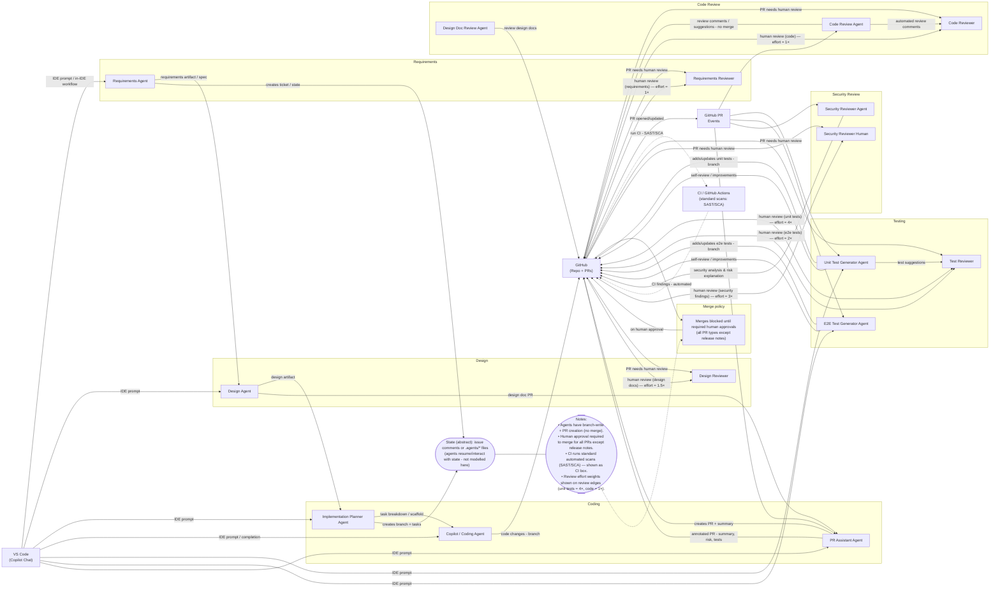

```mermaid
flowchart LR
  %% Layout direction
  %% Top row: Triggers / tools
  VSCode["VS Code\n(Copilot Chat)"]
  GitHub["GitHub\n(Repo + PRs)"]
  GHPREvents["GitHub PR\nEvents"]
  CI["CI / GitHub Actions\n(standard scans: SAST/SCA)"]

  %% SDLC stages (grouped)
  subgraph REQ [Requirements]
    RA[Requirements Agent]
    RRev[Requirements Reviewer]
  end

  subgraph DES [Design]
    DA[Design Agent]
    DRev[Design Reviewer]
  end

  subgraph COD [Coding]
    IP[Implementation Planner Agent]
    CA[Copilot / Coding Agent]
    PRA[PR Assistant Agent]
  end

  subgraph TST [Testing]
    UTA[Unit Test Generator Agent]
    ETA[E2E Test Generator Agent]
    TRev[Test Reviewer]
  end

  subgraph SEC [Security Review]
    SRA[Security Reviewer Agent]
    SecRev[Security Reviewer Human]
  end

  subgraph CR [Code Review]
    CRA[Code Review Agent]
    DDR[Design Doc Review Agent]
    CRev[Code Reviewer]
  end

  %% State / storage note (abstract)
  StateNote(["State (abstract): issue comments or .agents/* files\n(agents resume/interact with state - not modelled here)"])

  %% Legend / meta notes
  Notes(["Notes:\n• Agents have branch-write + PR creation (no merge).\n• Human approval required to merge for all PRs except release notes.\n• CI runs standard automated scans (SAST/SCA) — shown as CI box.\n• Review effort weights shown on review edges (unit tests = 4×, code = 1×)."])

  %% Triggers -> Agents
  VSCode -->|IDE prompt / in-IDE workflow| RA
  VSCode -->|IDE prompt| DA
  VSCode -->|IDE prompt| IP
  VSCode -->|IDE prompt / completion| CA
  VSCode -->|IDE prompt| UTA
  VSCode -->|IDE prompt| ETA
  VSCode -->|IDE prompt| PRA

  %% Requirements -> Design -> Implementation
  RA -->|requirements artifact / spec| DA
  RA -->|creates ticket / state| StateNote
  DA -->|design artifact| IP
  DA -->|design doc PR| PRA

  %% Implementation planning + coding flow
  IP -->|task breakdown / scaffold| CA
  IP -->|creates branch + tasks| StateNote
  CA -->|code changes - branch| GitHub
  UTA -->|adds/updates unit tests - branch| GitHub
  ETA -->|adds/updates e2e tests - branch| GitHub
  PRA -->|creates PR + summary| GitHub

  %% GitHub / PR event triggers
  GitHub -->|PR opened/updated| GHPREvents
  GHPREvents --> CRA
  GHPREvents --> UTA
  GHPREvents --> ETA
  GHPREvents --> PRA
  GHPREvents --> SRA

  %% CI scans (standard) run on PRs (dashed)
  GitHub -.->|run CI - SAST/SCA| CI
  CI -.->|CI findings - automated| GitHub

  %% Review agents comment / create suggested fixes
  CRA -->|review comments / suggestions - no merge| GitHub
  DDR -->|review design docs| GitHub
  UTA -->|self-review / improvements| GitHub
  ETA -->|self-review / improvements| GitHub
  SRA -->|security analysis & risk explanation| GitHub

  %% Human reviewers (per-stage) — PRs route to them
  GitHub -->|PR needs human review| RRev
  GitHub -->|PR needs human review| DRev
  GitHub -->|PR needs human review| CRev
  GitHub -->|PR needs human review| TRev
  GitHub -->|PR needs human review| SecRev

  %% Review edges with weights (annotations)
  CRev <-->|"human review (code) — effort = 1×"| GitHub
  TRev <-->|"human review (unit tests) — effort = 4×"| GitHub
  TRev <-->|"human review (e2e tests) — effort = 2×"| GitHub
  DRev <-->|"human review (design docs) — effort = 1.5×"| GitHub
  RRev <-->|"human review (requirements) — effort = 1×"| GitHub
  SecRev <-->|"human review (security findings) — effort = 3×"| GitHub

  %% PR Assistant + Review flow
  PRA -->|annotated PR - summary, risk, tests| GitHub
  CRA -->|automated review comments| CRev
  UTA -->|test suggestions| TRev

  %% Merge gate (policy)
  subgraph MergeGate [Merge policy]
    MG["Merges blocked until required human approvals\n(all PR types except release notes)"]
  end
  GitHub --> MG
  MG -->|on human approval| GitHub

  %% Notes and styling
  StateNote --- Notes
  Notes -.-> MG
```