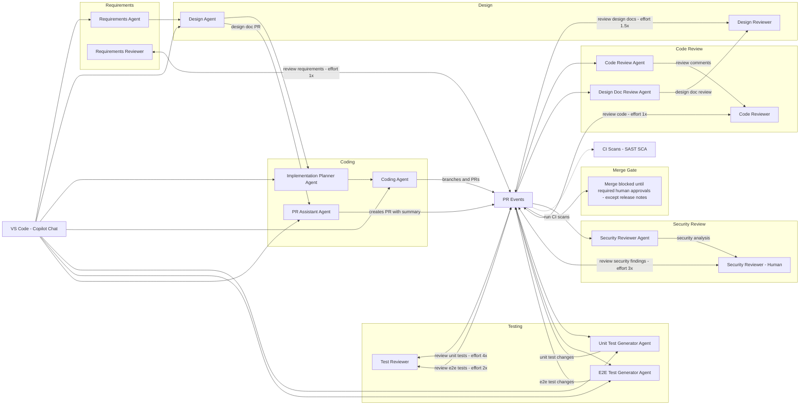

```mermaid
flowchart LR

  %% Top-level triggers
  VSCode["VS Code - Copilot Chat"]
  GHPREvents["PR Events"]
  CI["CI Scans - SAST SCA"]

  %% SDLC stages

  subgraph REQ [Requirements]
    RA[Requirements Agent]
    RRev[Requirements Reviewer]
  end

  subgraph DES [Design]
    DA[Design Agent]
    DRev[Design Reviewer]
  end

  subgraph COD [Coding]
    IP[Implementation Planner Agent]
    CA[Coding Agent]
    PRA[PR Assistant Agent]
  end

  subgraph TST [Testing]
    UTA[Unit Test Generator Agent]
    ETA[E2E Test Generator Agent]
    TRev[Test Reviewer]
  end

  subgraph SEC [Security Review]
    SRA[Security Reviewer Agent]
    SecRev[Security Reviewer - Human]
  end

  subgraph CR [Code Review]
    CRA[Code Review Agent]
    DDR[Design Doc Review Agent]
    CRev[Code Reviewer]
  end

  %% VS Code triggers agents
  VSCode --> RA
  VSCode --> DA
  VSCode --> IP
  VSCode --> CA
  VSCode --> UTA
  VSCode --> ETA
  VSCode --> PRA

  %% Requirements -> Design -> Coding
  RA --> DA
  DA --> IP
  DA -->|design doc PR| PRA
  IP --> CA

  %% Agents create PRs (implicit GitHub)
  CA -->|branches and PRs| GHPREvents
  UTA -->|unit test changes| GHPREvents
  ETA -->|e2e test changes| GHPREvents
  PRA -->|creates PR with summary| GHPREvents

  %% PR Event triggers
  GHPREvents --> CRA
  GHPREvents --> DDR
  GHPREvents --> UTA
  GHPREvents --> ETA
  GHPREvents --> SRA

  %% CI scans (dashed)
  GHPREvents -.->|run CI scans| CI

  %% Review agents comment
  CRA -->|review comments| CRev
  DDR -->|design doc review| DRev
  SRA -->|security analysis| SecRev

  %% Human review edges (with weights)
  RRev <-->|"review requirements - effort 1x"| GHPREvents
  DRev <-->|"review design docs - effort 1.5x"| GHPREvents
  CRev <-->|"review code - effort 1x"| GHPREvents
  TRev <-->|"review unit tests - effort 4x"| GHPREvents
  TRev <-->|"review e2e tests - effort 2x"| GHPREvents
  SecRev <-->|"review security findings - effort 3x"| GHPREvents

  %% Merge gate
  subgraph MG [Merge Gate]
    MGNode["Merge blocked until required human approvals - except release notes"]
  end
  GHPREvents --> MGNode
```