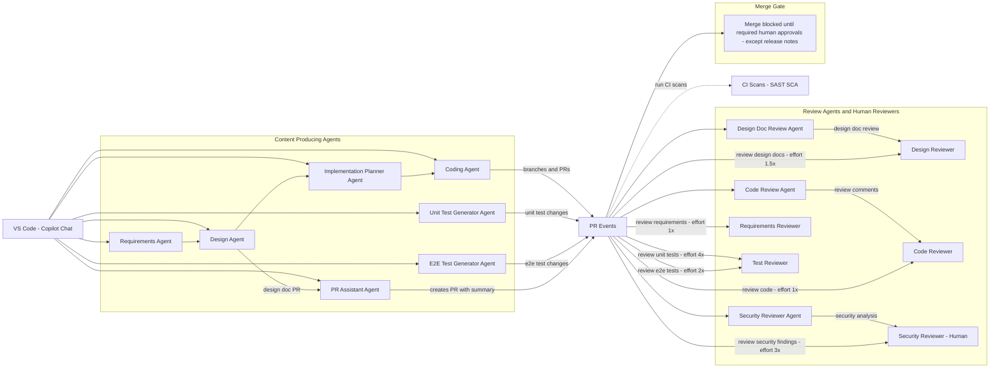

```mermaid
flowchart LR

  %% TRIGGERS
  VSCode["VS Code - Copilot Chat"]
  GHPREvents["PR Events"]
  CI["CI Scans - SAST SCA"]

  %% CONTENT PRODUCING AGENTS
  subgraph PROD [Content Producing Agents]
    direction TB
    RA[Requirements Agent]
    DA[Design Agent]
    IP[Implementation Planner Agent]
    CA[Coding Agent]
    UTA[Unit Test Generator Agent]
    ETA[E2E Test Generator Agent]
    PRA[PR Assistant Agent]
  end

  %% REVIEWING AGENTS AND HUMAN REVIEWERS
  subgraph REVS [Review Agents and Human Reviewers]
    direction TB

    %% AI reviewers
    CRA[Code Review Agent]
    DDR[Design Doc Review Agent]
    SRA[Security Reviewer Agent]

    %% Human reviewers
    RRev[Requirements Reviewer]
    DRev[Design Reviewer]
    CRev[Code Reviewer]
    TRev[Test Reviewer]
    SecRev[Security Reviewer - Human]
  end

  %% MERGE GATE
  subgraph MG [Merge Gate]
    MGNode["Merge blocked until required human approvals - except release notes"]
  end


  %% FLOWS

  %% IDE → Content producers
  VSCode --> RA
  VSCode --> DA
  VSCode --> IP
  VSCode --> CA
  VSCode --> UTA
  VSCode --> ETA
  VSCode --> PRA

  %% Requirements → Design → Planning → Coding
  RA --> DA
  DA --> IP
  DA -->|design doc PR| PRA
  IP --> CA

  %% Content producers push PRs (implicit GitHub)
  CA -->|branches and PRs| GHPREvents
  UTA -->|unit test changes| GHPREvents
  ETA -->|e2e test changes| GHPREvents
  PRA -->|creates PR with summary| GHPREvents

  %% PR triggers reviewers
  GHPREvents --> CRA
  GHPREvents --> DDR
  GHPREvents --> SRA

  %% CI scans
  GHPREvents -.->|run CI scans| CI

  %% Reviewer agent outputs
  CRA -->|review comments| CRev
  DDR -->|design doc review| DRev
  SRA -->|security analysis| SecRev

  %% Human review edges with weights
  GHPREvents -->|review requirements - effort 1x| RRev
  GHPREvents -->|review design docs - effort 1.5x| DRev
  GHPREvents -->|review code - effort 1x| CRev
  GHPREvents -->|review unit tests - effort 4x| TRev
  GHPREvents -->|review e2e tests - effort 2x| TRev
  GHPREvents -->|review security findings - effort 3x| SecRev

  %% Merge gate
  GHPREvents --> MGNode

```